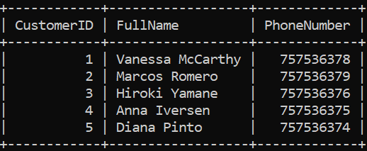
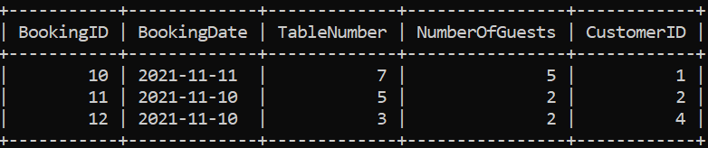
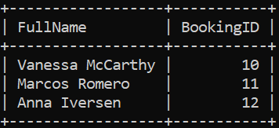
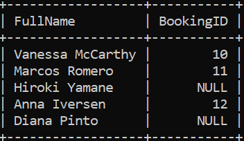
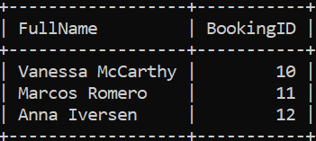

# INNER JOIN

É uma forma de pegar valores de colunas em diferentes tabelas, filtrando entre valores que dêem match.
Considere as duas tabelas a seguir:

* Tabela CustomerS:

* Tabela Bookings:

O código necessário para fazer um INNER JOIN nas duas tabelas, buscando qual BookingID está ligado a qual Customer, é:

SELECT Customer.FullName, BookingID from Customers INNER JOIN Bookings ON Customers.CustomerID = Bookings.CustomerID;

O resultado disso é:

# LEFT JOIN

Com LEFT JOIN é possível pegar todos os resultados da tabelas da esquerda + os resultados que deram match, ou seja, mais os resultados de um INNER JOIN.

Exemplo:

SELECT Customers.FullName, Bookings.BookingID 
FROM Customers LEFT JOIN Bookings 
ON Customers.CustomerID =  Bookings.CustomerID; 

Resultaria em: 

# RIGHT JOIN

Seguindo a loja do LEFT JOIN, aqui seria mostrado todos os valores da tabela à direita + os valores de um INNER JOIN.

Exemplo:

SELECT Customers.FullName, Bookings.BookingID 
FROM Customers RIGHT JOIN Bookings 
ON Customers.CustomerID =  Bookings.CustomerID;

Resultaria em: 

