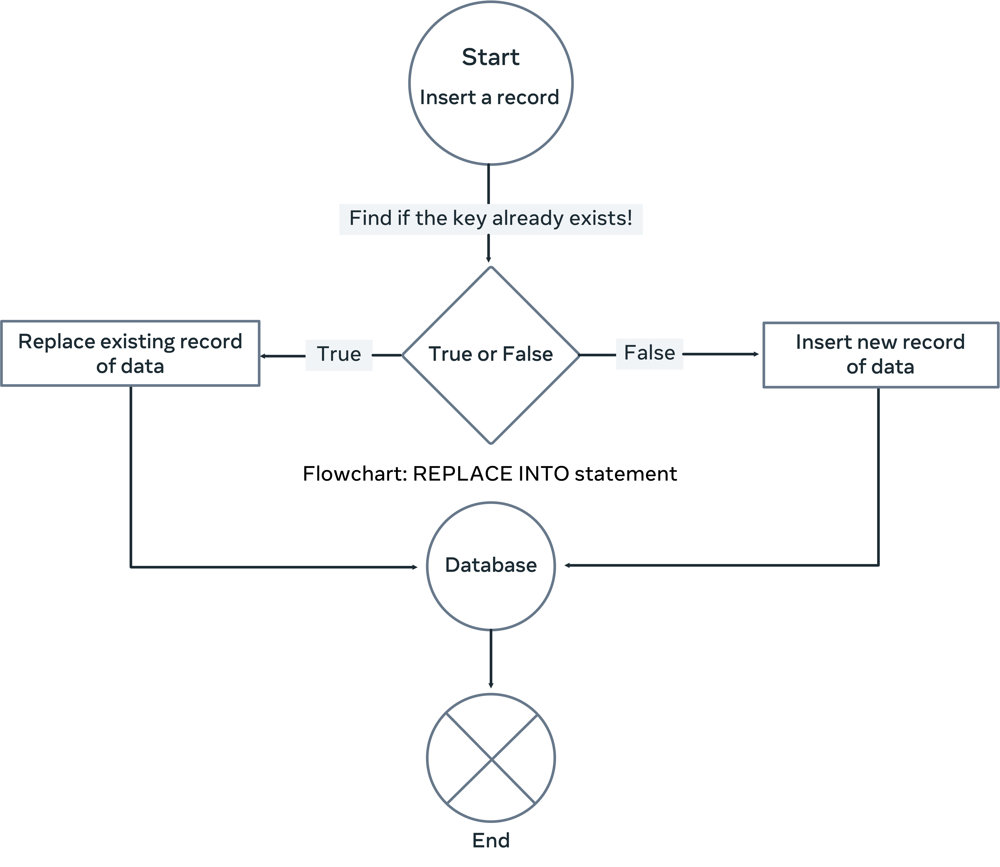

# Replace

O comando Replace serve para Substituir uma linha do banco de dados. Podendo ser usado de duas formas:

REPLACE INTO tableName(columnName1, columnName2, etc)
VALUES(newValue1, newValue2, etc);

ou

REPLACE INTO tableName(columnName1, columnName2, etc)
SET columnName=newValue, otherColumnName = newValue, etc;

O REPLACE de inicio procura um record na tabela que dê match com a primary key procurada, exclui esse record e adiciona o novo criado. Caso não encontre nenhum record com a key procurada, ele apenas adiciona um novo record à tabela. E caso encontre um record com a key procurada, mas nao tenha sido definido os novos valores de outras colunas, esses valores se tornarão o default.

Aqui está um work flow de como o Replace funciona: 

